# 豆排排 · 流程图集（整体 + 各功能）

> 拆分自 PLAN.md v5 配套文档（2026-08）。全部使用 Mermaid，GitHub/VS Code 直接渲染。
> 规格以 [PLAN.md](./PLAN.md) 为准；流程图变更需与对应章节同步。

## 目录

1. [整体架构](#1-整体架构)
2. [双模式认证流程](#2-双模式认证流程)
3. [任务状态机](#3-任务状态机)
4. [任务写路径与实时同步](#4-任务写路径与实时同步)
5. [通知系统全流程](#5-通知系统全流程)
6. [提及确认闭环](#6-提及确认闭环)
7. [看板拖拽流转](#7-看板拖拽流转)
8. [重复任务生成](#8-重复任务生成)
9. [提醒引擎与后台任务](#9-提醒引擎与后台任务)
10. [工作区邀请流程](#10-工作区邀请流程)
11. [附件上传](#11-附件上传)
12. [MCP 调用链路](#12-mcp-调用链路)
13. [甘特级联改期（P1）](#13-甘特级联改期p1)
14. [交付流程（工作包依赖）](#14-交付流程工作包依赖)

---

## 1. 整体架构

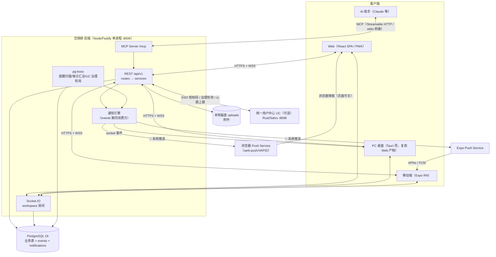

---

## 2. 双模式认证流程

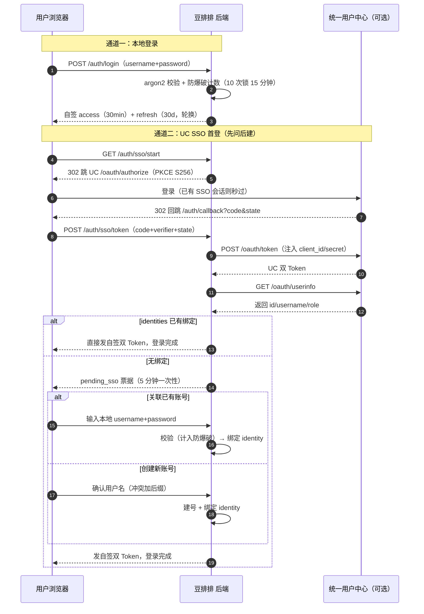

---

## 3. 任务状态机

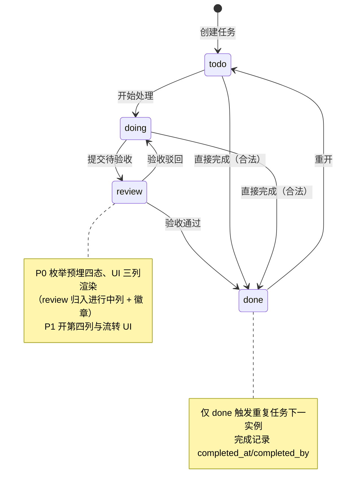

---

## 4. 任务写路径与实时同步

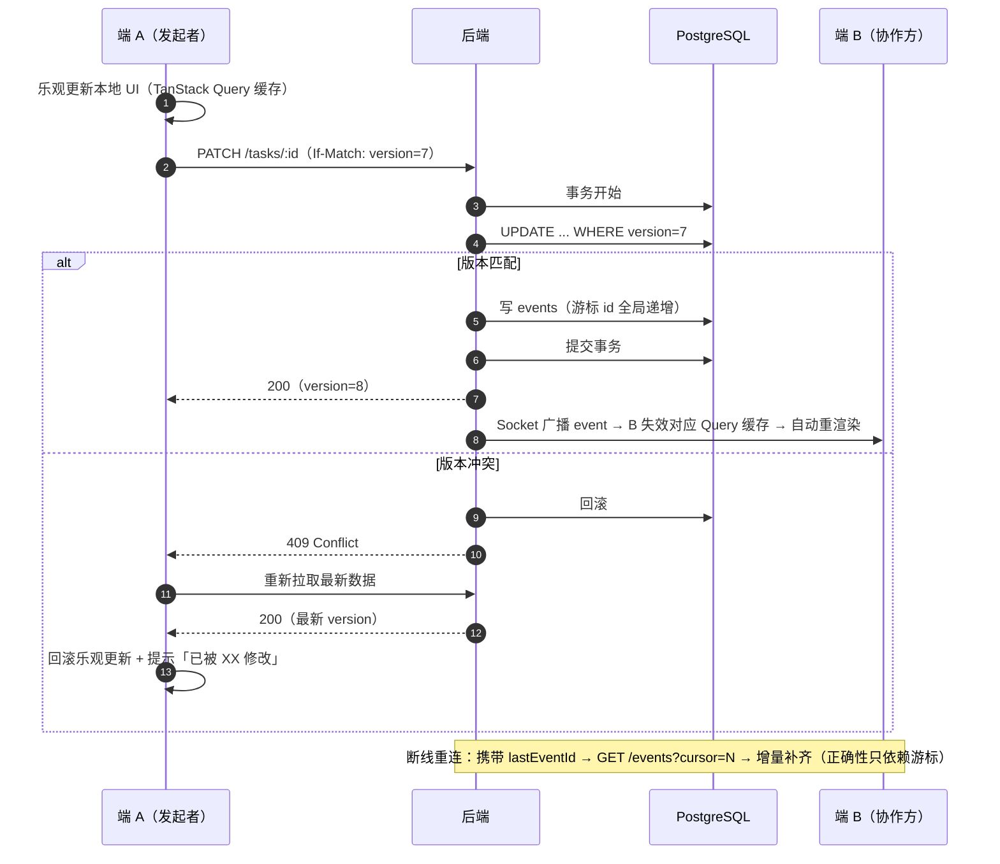

---

## 5. 通知系统全流程

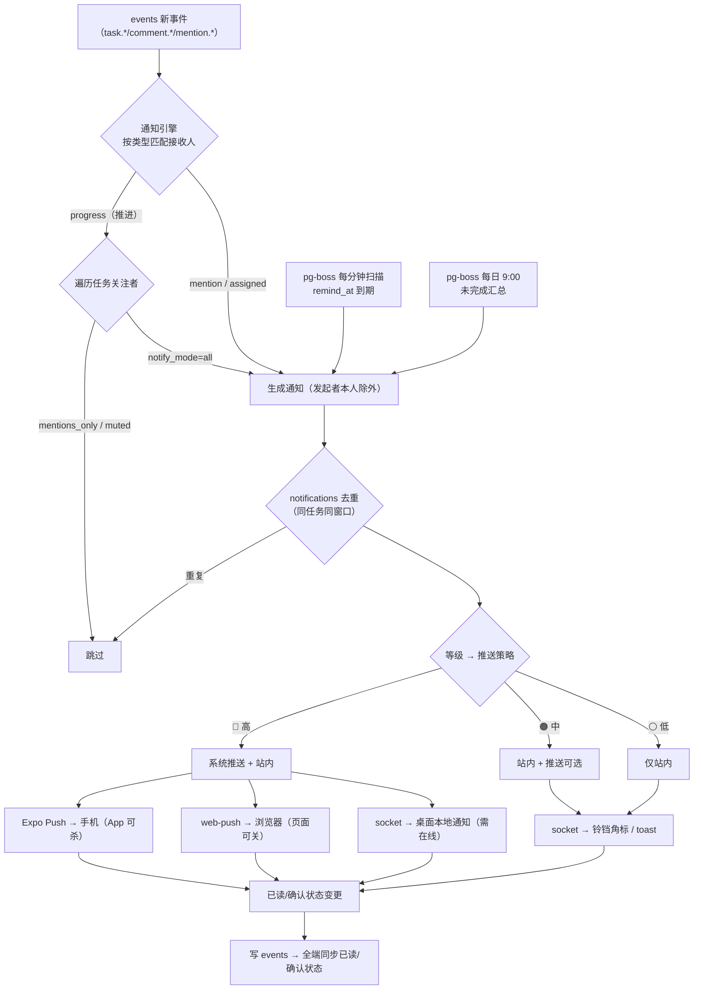

---

## 6. 提及确认闭环

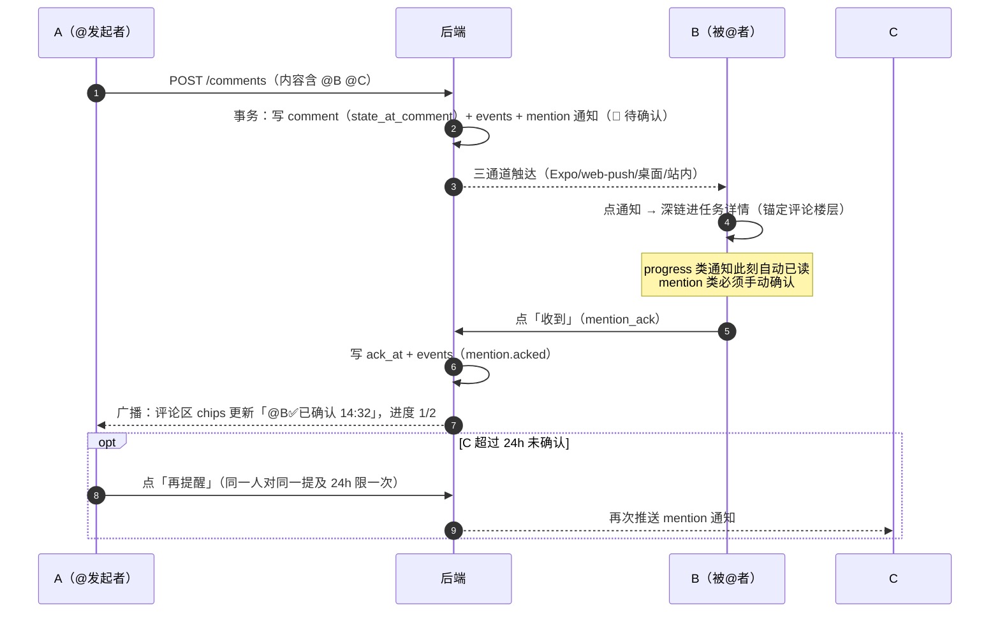

---

## 7. 看板拖拽流转

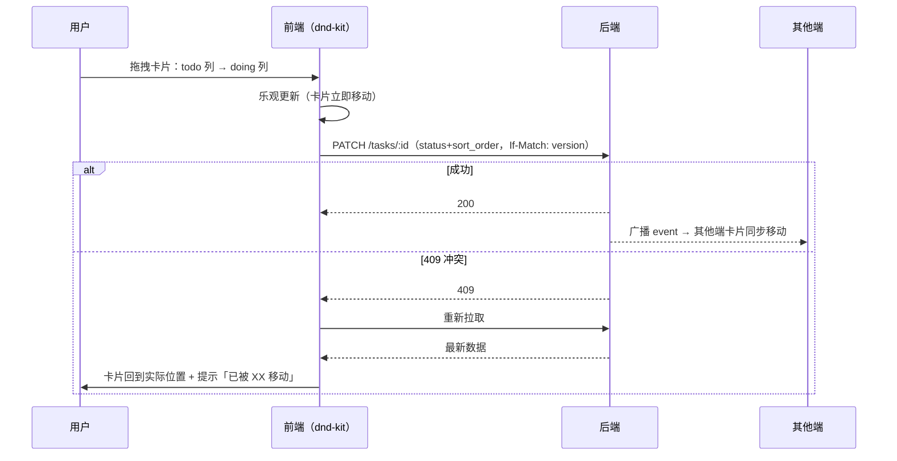

---

## 8. 重复任务生成

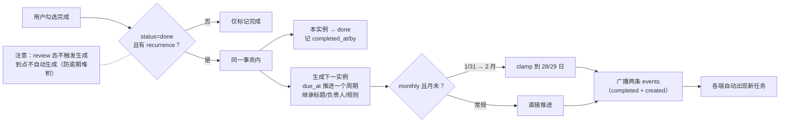

---

## 9. 提醒引擎与后台任务

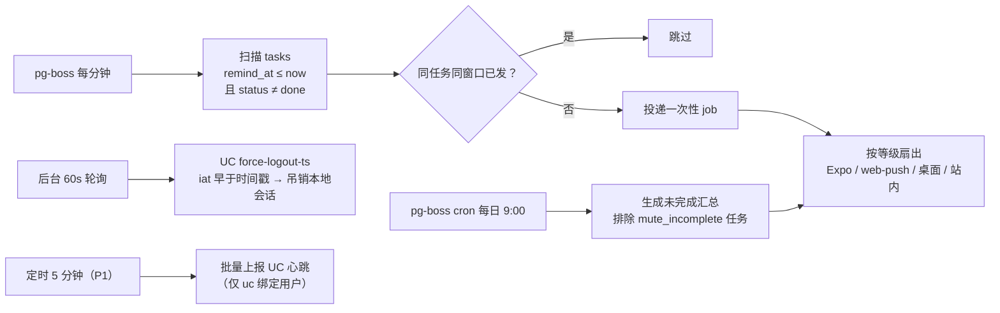

---

## 10. 工作区邀请流程

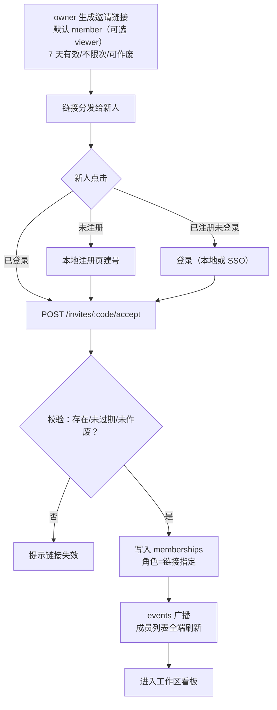

---

## 11. 附件上传

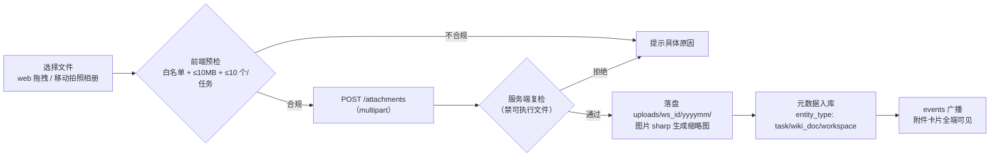

---

## 12. MCP 调用链路

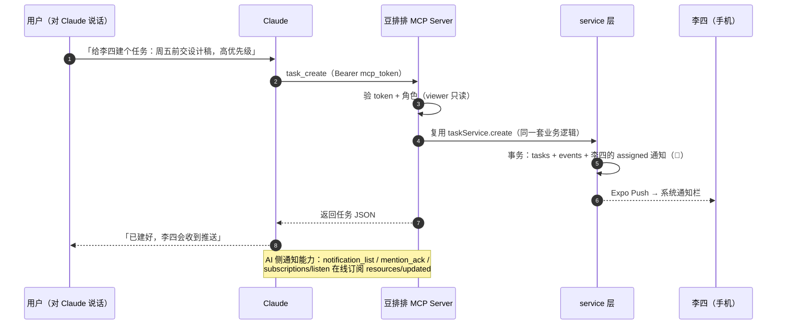

---

## 13. 甘特级联改期（P1）

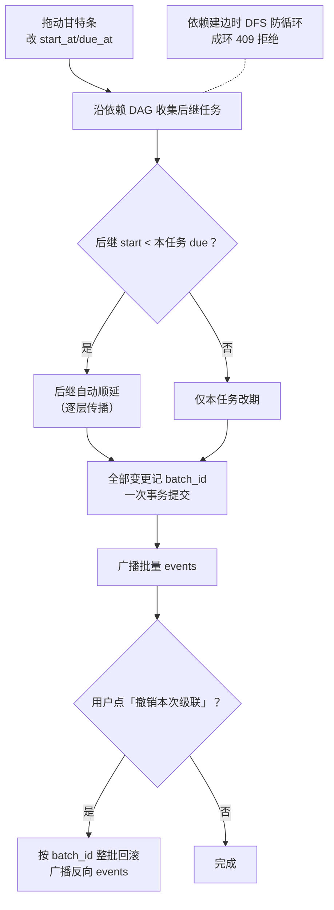

---

## 14. 交付流程（工作包依赖）

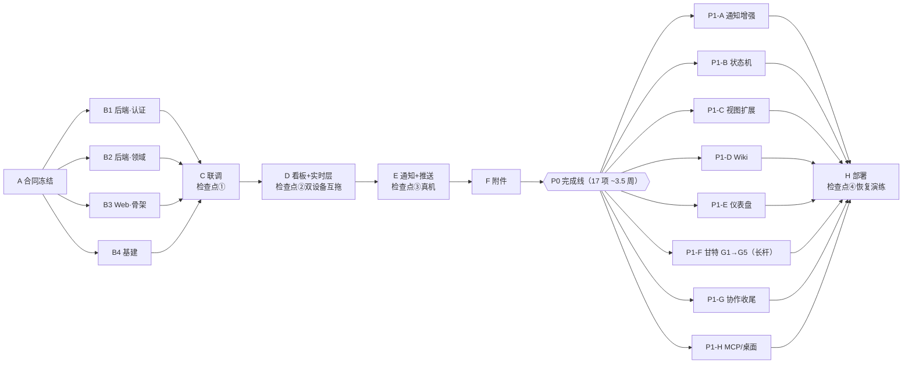
